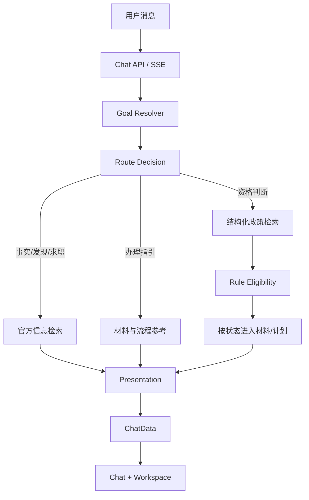

# 青程 Agent

面向高校毕业生和青年群体的就业创业政务办事 Agent。系统先理解用户本轮目标，再按需检索政策、解释办事流程或进行资格辅助判断；不会为了补全画像而把每次咨询变成固定问卷。对于具有时效性的政策问题，还可以按需检索最新官方公开信息。

> 本项目提供政策检索、资格初步判断、材料检查和办理路径规划，不代替政府部门审批，也不会自动向政府部门提交申请。政策效力、申报要求和最终审批结果以主管部门最新规定及实际审核为准。

## 核心能力

### 用户画像理解

系统采用“确定性规则解析 + 可选 LLM 结构化抽取”的方式理解当前用户消息。LLM 输出须经过严格 Pydantic 校验；不可用、超时或输出非法时，自动回退规则解析结果。

当前可积累的画像信息包括：

- 城市、学历、毕业年份和精确毕业日期；
- 就业状态、创业意图和求职意图；
- 社保缴纳月数、灵活就业参保情况；
- 经营主体注册时长等办事条件。

画像支持多轮补充、用户纠错和 Session 级隔离，并能处理：

- 相对时间：今年、去年、前年、明年；
- ISO 日期：`2025-06-20`；
- 中文日期：`2025年6月20日`；
- “待业”等自然语言状态归一。

系统也支持明确的否定式纠正，例如“不是未就业”“不是待就业”“已经不是待业状态”“不是灵活就业参保”“没有按灵活就业参保”。明确的 `false` 可以覆盖历史 `true`；“不是未就业”不会被武断推断为“已就业”，在用户没有说明新的就业状态时，系统会清除无法确认的旧状态，而不是编造新状态。

### 目标驱动对话与个性化资格查询

系统使用确定性的 Goal Resolver 与 Route Decision 区分用户当前任务，并通过 LangGraph 条件路由决定是否调用检索、资格、材料或计划能力。

- **政策事实咨询**：例如“创业社会保险补贴需要什么条件？”、“一次性创业补贴有多少钱？”。直接回答政策事实，不要求先补齐个人画像，也不自动输出资格、材料或办理计划。
- **政策发现与求职咨询**：例如“毕业生有什么就业支持？”、“我快毕业了，不知道去哪找工作”。优先提供就业见习、官方招聘、就业服务和可行动的下一步；用户明确不创业时，创业政策不会作为主要推荐。
- **个性化资格判断**：例如“我符合创业社会保险补贴吗？”。仅此类目标进入 `RuleEligibilityTool`；信息不足时只追问当前目标真正需要的 1～2 项信息。
- **办理指引**：例如“创业社会保险补贴怎么办理？”、“需要什么材料？”。直接提供流程、材料参考和官方来源，不把办理咨询误转为资格问卷。

短追问会结合会话中的活动目标处理。例如，先问“创业社会保险补贴需要什么条件”，再问“那我可以吗”会进入该政策的资格判断；继续问“需要什么材料”则仍围绕同一政策提供办理参考。

允许直接查询政策事实，不等于跳过规则引擎判断用户资格。事实查询在画像不足时只说明结构化政策事实与官方证据，不输出“您符合”或“您不符合”的个性化结论。

### 政策检索与证据

项目采用两层政策信息来源：

1. **本地已核验政策库**：通过 `PolicyRepository` 加载 `policies.json` 和对应 raw Markdown，使用轻量本地 RAG 召回政策与原文证据。
2. **实时官方政策搜索**：通过 `TavilyRealtimeSearchProvider` 按需查询最新政策、申报窗口、截止日期和历史官方通知。

只有本地政策库中的结构化 `PolicyRecord` 才能正式进入资格判断、材料检查和办理计划。实时搜索结果用于补充官方证据，不能替代结构化规则。

### 确定性业务判断

- `RuleEligibilityTool` 负责资格状态，不由 LLM 决定 `PASS / FAIL`；
- `MaterialCheckTool` 根据结构化材料和用户明确声明更新材料状态；
- `PolicyCompareTool` 只读取显式配置的政策关系，不根据名称或主题猜测；
- `PlanTool` 根据候选政策、资格、缺失条件和材料情况生成稳定的办理步骤。

## 系统架构



主要技术栈：

- Frontend：Vue 3、TypeScript、Vite；
- Backend：FastAPI、Pydantic、LangGraph 条件编排；
- Policy：PolicyRepository、PolicyRecord、PolicyCondition；
- Retrieval：RagPolicySearchTool、中文字符 n-gram TF-IDF、LocalPolicySearchTool fallback；
- Realtime Search：Tavily Search API、httpx async client、官方域名 allowlist；
- Eligibility：RuleEligibilityTool；
- Planning：PolicyCompareTool、MaterialCheckTool、PlanTool；
- LLM：OpenAI-compatible provider，仅用于画像抽取和必要的结果解释。

## Agent Workflow

### 目标政策锁定

当用户明确点名“就业见习”“创业社会保险补贴”“灵活就业社会保险补贴”等政策时，系统会将其锁定为当前目标政策。检索可以保留多个相关候选，但资格追问、材料参考与办理指引只围绕该目标政策生成；后续“那我可以吗”“怎么申请”等短追问会优先延续该目标。

求职目标优先提供就业服务、就业见习与毕业生就业支持方向；用户明确表示不创业时，创业类政策不会作为主要推荐。

生产链路为：

```text
用户请求
  → GoalResolver
  → RouteDecider
  → LangGraph Conditional Routing
  ├─ 事实 / 政策发现 / 求职：官方信息检索 → 展示
  ├─ 资格判断：结构化政策检索 → RuleEligibilityTool → 按状态进入材料/计划
  └─ 办理指引：结构化政策检索 → 材料与流程参考
  → Presentation / Deterministic Fallback
```

- 政策事实、政策发现与求职咨询遵循“先回答、必要时再追问”，不会默认运行资格、材料或计划；
- 个性化资格判断仍在必要画像缺失时生成有限追问，并提前停止后续个性化判断；
- 闲聊、画像更新等非政策目标不联网、不检索、不进入资格链；
- 无关主题直接分流，不进入政策检索、画像追问或实时搜索；
- 官方联网检索优先服务政策事实、政策发现与求职目标；Dify/本地 RAG 用于证据补充与故障回退，异常时继续回退 `LocalPolicySearchTool`；
- `RealtimePolicySearchNode` 只在当前目标需要政策信息时运行，并非每次请求都联网；搜索结果会经过官方来源、主题相关性和去重过滤；
- `RuleEligibilityTool` 是资格判断的唯一确定性来源；
- 后续节点始终使用本轮最新候选政策重新计算，不累积上一轮失效的资格、追问或计划。

对公开接口保持兼容：

```text
POST /api/agent/chat
POST /api/agent/chat/stream
```

SSE 事件保持 `delta / done / error`。确定性回复可以没有 `delta`，但成功路径最后一个事件始终为 `done`，完整结果位于 `done.data`。

## 政策资料、知识检索与证据

结构化政策资料主要聚焦苏州市高校毕业生和青年就业创业场景，来源主要为：

- 苏州市人民政府；
- 苏州市人力资源和社会保障局。

数据目录：

```text
backend/data/policies/policies.json
backend/data/policies/raw/*.md
backend/data/policies/policy_relations.json
```

本地检索链路：

```text
Markdown 标题优先切分
  → Metadata Filter（地区 / 主题 / 目标人群 / 时效状态）
  → 中文字符 2/3-gram TF-IDF
  → 余弦相关性排序 + Top-K + 最低相关度阈值
  → PolicyCandidate 去重
```

每个命中片段保留政策 ID、政策名称、官方 `sourceUrl`、时效状态、最后核验日期和片段信息。这是零新增模型依赖的本地文本相关性检索，不是 embedding 模型或外部向量数据库。

项目还支持可选的 Dify Knowledge 检索。Dify 返回的是只读事实证据：已映射到 `PolicyRepository` 的文档可以辅助结构化政策召回；未映射的知识资料仅可用于事实说明，不能进入资格判断、材料检查或办理计划。Dify 不可用时，检索链路继续回退本地 RAG 与 `LocalPolicySearchTool`。

`policy_relations.json` 当前保持空关系集合：现有政策没有足够官方依据支持 `MUTEX` 或 `PREREQUISITE`，项目不会为了展示效果制造政策关系。

### 政策方向意图约束

本地检索不会只依赖 RAG 相关性分数，还会结合用户明确意图和政策结构化元数据进行确定性约束。

- 用户明确“正在创业 / 准备创业”，且没有表达灵活就业参保时，纯灵活就业政策不会仅因“社保”文本相似而被错误召回；
- 用户明确“我不是创业，我只是按灵活就业交社保”时，创业方向退出，灵活就业方向进入评估；
- 用户明确同时表达创业与灵活就业参保时，两个方向可以同时保留。

## 实时官方政策检索

项目已接入 `TavilyRealtimeSearchProvider`。实时检索主要服务于：

- 最新政策发现；
- “现在还能不能申请”等当前状态查询；
- 最新官方通知、申报窗口和截止日期；
- 明确的历史官方申报通知查询。

默认官方域名 allowlist：

```text
suzhou.gov.cn
hrss.suzhou.gov.cn
```

Provider 请求时使用 domain restriction；返回结果还会再次经过本地 HTTPS、hostname 和 allowlist 校验。项目不直接抓取任意用户 URL，不执行网页脚本，也不把第三方转载作为正式实时证据。

### 触发规则

当本轮目标需要政策或就业信息时，系统优先进行官方信息检索；例如政策事实、政策发现、求职咨询、当前性查询和历史通知查询。以下表达也会形成明确的实时检索信号：

- 最新、最近发布、新政策；
- 现在还能申请吗、还能申领吗；
- 申报窗口、截止时间；
- 明确查询之前、往年、当时的官方申报通知。

单纯画像事实不会因为出现年份或届别而触发 Tavily，例如：

- “我是2026届毕业生”；
- “我2026年毕业”；
- “毕业日期是2026年6月20日”。

闲聊、画像更新、致谢和无关主题不会触发实时检索。这保证“Web-first”表示政策信息优先来自官方公开来源，而不是每条消息都联网。

### 历史通知排序

明确历史查询会在 Tavily 原始结果之上进行确定性重排，综合目标届别、政策主题、申报/通知/截止等正式语义，以及与本地 `PolicyRecord` 的可靠关联。

例如“我想看2026届求职创业补贴之前的申报通知”会优先展示对应 2026 届的正式申报通知；2027 届通知、泛化就业工作通知、栏目页或校友分享页可以保留为弱相关补充，但不会优先于明确匹配结果。若网页标题没有写届别、但官方 URL 可可靠关联本地 2026 届记录，仍会得到优先排序。

### 与资格判断的边界

实时网页搜索结果不等于资格判断结果。Tavily 负责发现最新官方公开信息；资格判断仍由：

```text
PolicyRepository
  + PolicyCondition
  + RuleEligibilityTool
```

共同完成。

当实时搜索发现本地 Repository 尚未结构化的新政策时，结果保持 `relatedPolicyId = None`，系统只提示：

> 发现新的官方政策/通知，但尚未完成结构化核验，暂不能自动判断是否符合。

该结果不会自动进入 `policies`、`eligibility`、`materialResults` 或生成 `APPLY_POLICY` 计划。即使实时证据可靠关联了已有政策，资格判断也仍读取本地 PolicyRecord 规则。

## 资格判断

`RuleEligibilityTool` 根据结构化 `PolicyCondition` 执行确定性判断，当前基础 operator 包括：

```text
eq / gte / lte / in / not_in / exists / within_years
```

状态与用户侧语义：

| 状态 | 用户侧含义 |
|---|---|
| `PASS` | 基本符合 |
| `FAIL` | 当前信息下暂不符合 |
| `UNKNOWN` | 信息不足，暂无法判断 |
| `MANUAL_REVIEW` | 需要人工核验 |

LLM 可以解释结果，但不能生成或覆盖上述资格状态。缺少字段时，追问只从当前候选政策的真实 `missingFields` 生成，并对相同问题去重。

系统区分政策依据有效性与申报窗口状态：

- 政策依据记录 `ACTIVE / EXPIRED / HISTORICAL / UNKNOWN`；
- 申报窗口独立记录 `OPEN / CLOSED / NOT_STARTED / UNKNOWN`；
- `CLOSED` 不等于资格 `FAIL`，历史或关闭记录也不会被描述成当前仍可申请；
- 普通当前咨询优先当前有效政策；明确历史查询允许历史通知优先召回。

## 材料检查与办理计划

### 材料检查

`MaterialCheckTool` 支持：

```text
READY / MISSING / UNKNOWN / MANUAL_REVIEW
```

用户可以通过自然语言或 Workspace 操作声明“我已准备”“我还没有”。前端会实际发送 Chat/SSE 请求，材料状态由后端 Session 保存并重新计算；Workspace 只使用最新 SSE `done.data`，不会在本地伪造业务结果。

对于 `HISTORICAL` 或申请窗口 `CLOSED` 的记录，材料仅作为历史参考展示，并隐藏会改变当前材料状态的操作。

### 办理计划

确定性 PlanTool 根据政策候选、资格状态、缺失条件和材料情况生成以下动作：

```text
PROVIDE_INFO
VERIFY_ELIGIBILITY
PREPARE_MATERIALS
MANUAL_REVIEW
APPLY_POLICY
WAIT_FOR_WINDOW
NOTICE
```

`FAIL`、历史或失效政策不会进入当前申请主路径；窗口关闭会生成等待或提示步骤；多个政策缺少相同字段时只生成一条统一补充步骤。系统只规划办理路径，不自动审批或提交正式申请。

## 多轮会话与 Session

每个 Session 独立保存：

- 内部用户画像；
- 材料声明；
- 政策查询上下文；
- 对话历史。

新建任务不会继承其他任务的学历、毕业年份、意图、社保信息或材料状态。Session 会持久保存活动目标和活动政策：当下一轮只说“其实我是硕士”时，系统可以更新画像而不丢失原政策主题；当用户明确转为“我只想找工作”时，旧资格任务会停止。

前端按 Session 保存各自最新的 `ChatData`，`activeSessionId` 与会话列表保存在 localStorage，刷新页面后恢复当前任务。`delta` 只更新聊天流式文本，`done` 一次性写入完整 `done.data`，`error` 保留上一份有效 Workspace 数据。

后端当前使用进程内 `InMemorySessionStore`。服务重启后后端画像、材料声明和查询上下文不会持久化；后续如需生产部署，应在现有 Store 接口后接入持久化实现。

## Final Explanation 与性能优化

Final Explanation LLM 并非每次请求都调用。以下确定性场景可以直接跳过：

- 政策事实咨询的已核验直接回复；
- 无关主题分流；
- 当前目标所需信息的补充回复；
- 仅命中历史通知、未找到相关政策或仅更新材料状态；
- 仅说明实时查询状态的回复。

复杂多政策比较或确有必要的资格解释仍可使用 Final Explanation LLM。当前默认超时配置：

```env
PROFILE_EXTRACTION_TIMEOUT_SECONDS=5
FINAL_EXPLANATION_TIMEOUT_SECONDS=12
```

如果 LLM 超时或不可用，系统保留完整结构化 `ChatData`，HTTP/SSE 主链路正常结束，并自动使用 deterministic fallback。

针对过去部分简单请求出现的 17～24 秒长尾，当前实测参考值包括：学历纠正约 2～3 秒、历史通知约 2～3 秒、材料状态更新约 3～4 秒。上述数字是本地环境优化结果，不是生产 SLA；核心改进是简单确定性路径不再无意义等待 Final LLM。

## 快速开始

### 后端

```powershell
cd backend
python -m venv .venv
.\.venv\Scripts\Activate.ps1
pip install -r requirements.txt
python -m uvicorn app.main:app --reload
```

- API：`http://127.0.0.1:8000`
- Swagger：`http://127.0.0.1:8000/docs`

### 前端

```powershell
cd frontend
npm install
npm run dev
```

前端开发地址：`http://127.0.0.1:5173`

## 环境变量

复制 `backend/.env.example` 为 `backend/.env`，再按本地环境填写。不要提交 `.env`、真实 API Key 或 Token。

LLM 相关配置示例：

```env
LLM_BASE_URL=你的_OpenAI_兼容服务地址
LLM_API_KEY=
LLM_MODEL=你的模型名称
PROFILE_EXTRACTION_ENABLED=true
PROFILE_EXTRACTION_TIMEOUT_SECONDS=5
FINAL_EXPLANATION_TIMEOUT_SECONDS=12
```

启用 Tavily 实时搜索：

```env
REALTIME_POLICY_SEARCH_ENABLED=true
REALTIME_POLICY_SEARCH_PROVIDER=tavily
REALTIME_POLICY_SEARCH_API_KEY=
REALTIME_POLICY_ALLOWED_DOMAINS=suzhou.gov.cn,hrss.suzhou.gov.cn
REALTIME_POLICY_SEARCH_TIMEOUT_SECONDS=8
REALTIME_POLICY_SEARCH_MAX_RESULTS=5
```

可选启用 Dify Knowledge：

```env
DIFY_KNOWLEDGE_ENABLED=false
DIFY_BASE_URL=https://api.dify.ai/v1
DIFY_DATASET_ID=
DIFY_DATASET_API_KEY=
DIFY_KNOWLEDGE_TIMEOUT_SECONDS=5
DIFY_KNOWLEDGE_TOP_K=5
```

真实 Key 只能保存在本地 `backend/.env`。仓库中的 `.env.example` 必须保持所有 Key 为空。实时检索或 Dify 未配置、无结果、超时或 Provider 异常时，结构化政策、资格、材料和计划链路仍可按对应路由继续执行。

## 测试与验证

Backend 全量测试：

```powershell
cd backend
D:\venvs\qincheng-agent\Scripts\python.exe -m pytest --basetemp="$env:USERPROFILE\qincheng-pytest-tmp"
```

也可以在已激活项目虚拟环境后执行 `pytest`。

Frontend：

```powershell
cd frontend
npm run test:workspace
npm run typecheck
npm run build
```

当前验证基线：

- Backend：`363 passed`；
- Workspace tests：通过；
- TypeScript typecheck：通过；
- Frontend build：通过。

Realtime / Provider 测试覆盖 Tavily 正常响应、timeout、401/403、429、5xx、非法响应、官方域名过滤、Provider 装配和调用次数；同时覆盖闲聊、画像更新与无关主题不调用实时 Provider。

## 当前验证说明

最近一次本地验证为：

- Backend：`363 passed`；
- Frontend workspace tests、typecheck、build：通过；
- 后端回归覆盖目标路由、实时检索边界、资格规则、材料状态、会话隔离与 SSE 协议。

请在发布或比赛演示前按下方典型场景完成真实浏览器回归。项目不宣称“零 Bug”，最终政策事实、申报窗口和审核结论始终以主管部门公开口径为准。

## 典型演示场景

### 1. 政策条件事实查询

输入：

> 创业社会保险补贴需要什么条件？

展示政策事实咨询：无需先补完整画像，可直接查看已核验政策条件与官方来源。

### 2. 当前政策实时查询

输入：

> 苏州创业社会保险补贴现在还能申请吗？

展示当前政策咨询、Tavily 实时官方搜索、当前状态查询，以及实时证据与资格判断隔离。

### 3. 个性化资格追问

输入：

> 我符合创业社会保险补贴吗？

展示个性化资格判断、有限追问与 `RuleEligibilityTool`。

### 4. 完整创业画像

输入：

> 我在苏州，本科，2025年6月20日毕业，目前创业中，准备创业，连续缴纳社保12个月，公司注册12个月

展示精确画像、创业政策收敛、`PASS`、材料清单和办理计划。

### 5. 灵活就业意图收敛

输入：

> 我不是创业，我只是自己按灵活就业交社保

展示明确否定创业、灵活就业政策收敛和确定性意图过滤。

### 6. 历史申报通知

输入：

> 我想看2026届求职创业补贴之前的申报通知

展示历史通知查询、Tavily 官方检索、届别/主题重排和历史材料只读。

### 7. 相对年份与增量追问

输入：

> 我去年本科毕业，目前待业，我在苏州

展示相对年份理解、画像归一、政策匹配，以及只针对缺失字段生成的追问。

### 8. 无关主题分流

输入：

> 周末哪里看电影？

展示无关问题直接分流：不强制进入画像收集、不召回政策、不调用 Tavily。

## 安全与可信性

- 实时搜索只允许 HTTPS 官方域名，并对 hostname 做二次校验；
- Provider domain restriction 与本地 allowlist 双重限制来源；
- 实时网页证据与结构化资格判断隔离；
- LLM 不直接决定 `PASS / FAIL / UNKNOWN / MANUAL_REVIEW`；
- 新政策未结构化前不能进入 Eligibility、Material 或 Plan；
- Provider 失败自动回退可用的本地检索路径，不中断主对话流程；
- Session 画像、材料和查询上下文相互隔离；
- Tavily 与 LLM Key 只读取本地环境变量，不进入 Git；
- 日志记录状态与阶段耗时，不记录 API Key。

## 当前限制

- 结构化知识库当前主要聚焦苏州市高校毕业生和青年就业创业政策，不保证覆盖全国或苏州市全部政策；
- 实时发现的新政策必须经过人工核验和结构化后，才能进入自动资格判断；
- 部分政策条件、材料和办理口径仍需要 `MANUAL_REVIEW`；
- 实时搜索依赖 Tavily 服务和官方网页可用性；
- 后端 Session 当前为进程内存储，尚未接入业务数据库；
- PDF、OCR、文件上传和复杂附件审核尚未作为正式核心能力；
- 系统不自动提交政府申请，也不代替主管部门正式审批；
- 最终政策效力、申报窗口和审批结果以对应主管部门为准。

比赛演示脚本见 [docs/COMPETITION_SCENARIOS.md](docs/COMPETITION_SCENARIOS.md)，发布前检查见 [docs/RELEASE_CHECKLIST.md](docs/RELEASE_CHECKLIST.md)。
